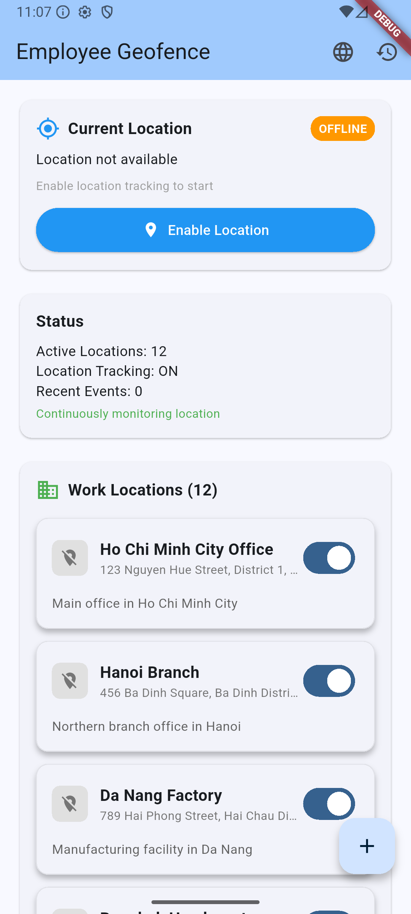
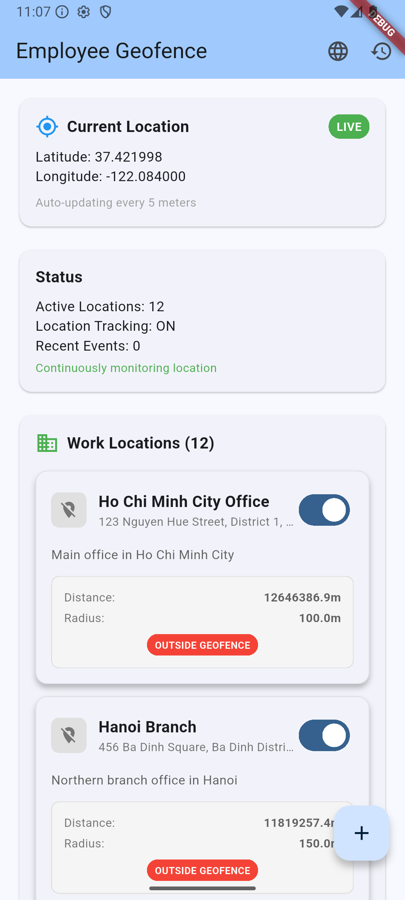
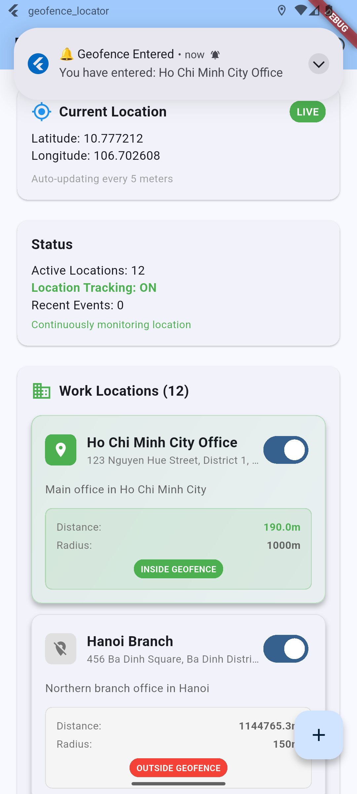
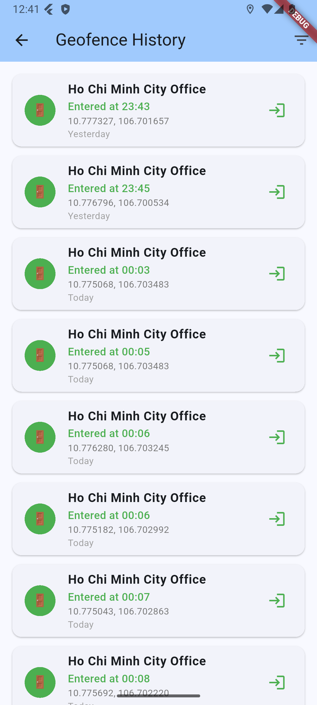
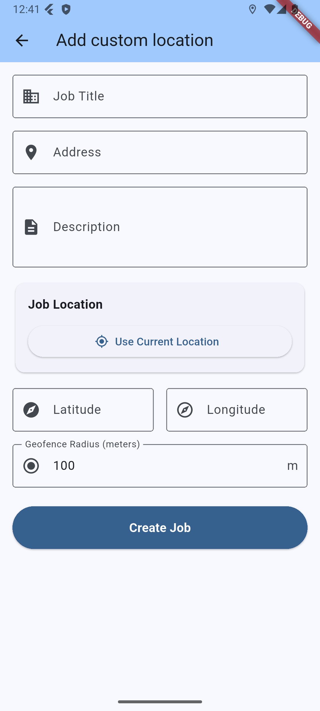
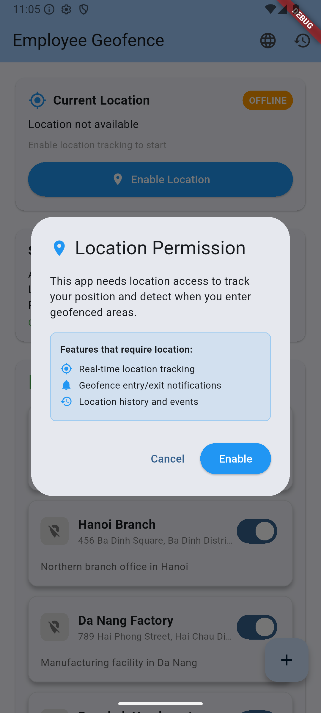
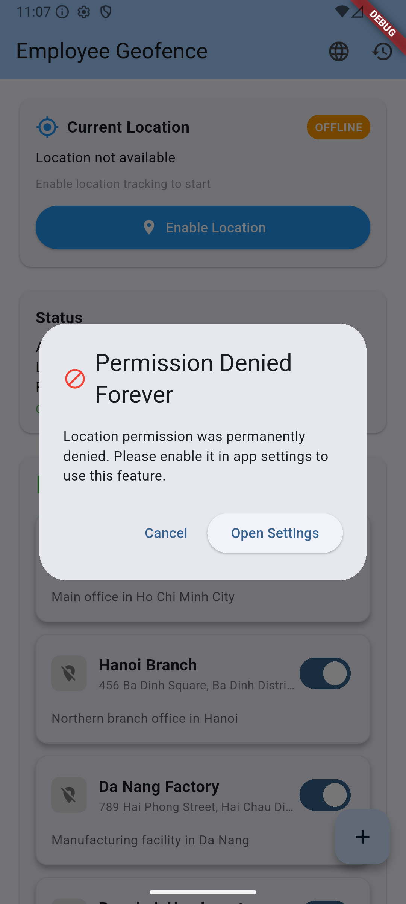
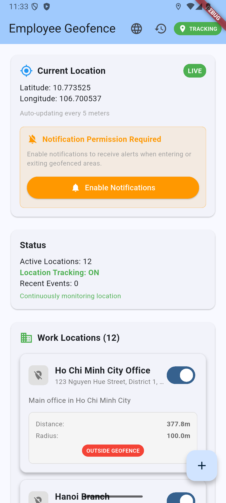

# 🏢 Employee Geofence - Flutter App

A comprehensive employee management application with real-time geofencing capabilities, designed to track employee locations and trigger notifications when entering or exiting predefined work areas.

## 🌟 Features

### 📍 **Real-time Location Tracking**

- Continuous GPS monitoring with 5-meter accuracy
- Background location tracking even when app is closed
- Live location updates with coordinates display
- Automatic geofence detection

### 🔔 **Smart Geofence Notifications**

- Entry/exit notifications for predefined work areas
- Single notification per entry (no spam)
- Background notification support
- Customizable notification settings

### 🏢 **Work Location Management**

- 12 predefined locations across Vietnam, Malaysia
- Mock backend integration for location updates
- Radius-based geofence definition
- Active/inactive location toggles

### 📊 **Event History & Analytics**

- Complete geofence event logging
- Time-stamped entry/exit records
- Filterable history (Today, Week, Month, All)
- Detailed event information with coordinates

### 🌍 **Multi-language Support**

- English, Vietnamese, Malay localization
- Dynamic language switching
- Localized UI elements and notifications

### ⚙️ **Advanced Permissions**

- Location permission management
- Notification permission handling
- Background service permissions
- Battery optimization settings

## 📱 Demo Screenshots

### 🏠 **Main Dashboard**


*Clean, modern interface with real-time location tracking and status indicators*

### 📍 **Live Location Tracking**


*Real-time coordinates display with live tracking status and geofence monitoring*

### 🔔 **Geofence Notification**


*Instant notification when entering a geofenced work area*

### 📋 **Event History**


*Comprehensive geofence event logging with timestamps and location details*

### ➕ **Add Custom Location**


*Manual location creation with coordinate input and current location detection*

### ⚠️ **Permission Management**


*User-friendly permission request with clear feature explanations*

### 🔒 **Permission Denied Flow**


*Graceful handling of permission denial with helpful guidance*

### 🔔 **Notification Permission**


*Notification permission setup for geofence alerts*

## 🚀 Getting Started

### Prerequisites

- Flutter SDK 3.32.4+
- Android Studio / VS Code
- Android device or emulator
- Location services enabled

### Installation

1. **Clone the repository**

```bash
git clone https://github.com/your-username/geofence-locator.git
cd geofence_locator
```

2. **Install dependencies**

```bash
flutter pub get
```

3. **Run the app**

```bash
flutter run
```

### Configuration

1. **Enable Location Services**
   - Grant location permissions when prompted
   - Enable background location access
   - Allow location services in device settings

2. **Enable Notifications**
   - Grant notification permissions
   - Configure notification settings
   - Test geofence notifications

3. **Background Service**
   - App automatically starts background tracking
   - No additional configuration required
   - Battery optimization may need adjustment

## 🏗️ Architecture

### **BLoC Pattern Implementation**

```
lib/
├── blocs/
│   ├── location/
│   ├── geofence/
│   └── language/
├── repositories/
├── services/
├── models/
├── screens/
├── widgets/
└── routes/
```

### **Key Components**

#### **Services**

- `BackgroundService`: Continuous location tracking
- `NotificationService`: Local notification management
- `LocationService`: GPS and permission handling
- `StorageService`: Local data persistence
- `MockApiService`: Backend simulation

#### **BLoCs**

- `LocationBloc`: Location state management
- `GeofenceBloc`: Geofence event handling
- `LanguageBloc`: Localization management

#### **Models**

- `Location`: Work location data
- `GeofenceEvent`: Event logging
- `Job`: Legacy job model (deprecated)

## 🔧 Technical Details

### **Dependencies**

```yaml
dependencies:
  flutter:
    sdk: flutter
  geolocator: ^10.1.0
  flutter_local_notifications: ^17.0.0
  permission_handler: ^11.0.1
  shared_preferences: ^2.2.2
  flutter_bloc: ^8.1.4
  equatable: ^2.0.5
  flutter_localizations:
    sdk: flutter
  intl: ^0.20.2
```

### **Android Permissions**

```xml
<uses-permission android:name="android.permission.ACCESS_FINE_LOCATION" />
<uses-permission android:name="android.permission.ACCESS_COARSE_LOCATION" />
<uses-permission android:name="android.permission.ACCESS_BACKGROUND_LOCATION" />
<uses-permission android:name="android.permission.FOREGROUND_SERVICE" />
<uses-permission android:name="android.permission.POST_NOTIFICATIONS" />
```

### **Background Service**

- Custom implementation for continuous tracking
- 20-meter distance filter for efficiency
- Automatic geofence status management
- Battery-optimized location updates

## 🧪 Testing

### **Test Coverage**

```bash
flutter test --coverage
```

### **Test Categories**

- **Unit Tests**: BLoC logic, services, repositories
- **Widget Tests**: UI components
- **Integration Tests**: End-to-end workflows

### **Mock Data**

- 12 predefined locations across Southeast Asia
- Simulated backend API responses
- Test geofence scenarios

## 📊 Performance

### **Location Tracking**

- **Accuracy**: 5-meter precision
- **Update Frequency**: Every 5 meters moved
- **Battery Impact**: Optimized for minimal drain
- **Background**: Continuous operation

### **Geofence Detection**

- **Response Time**: < 1 second
- **Accuracy**: GPS-based distance calculation
- **Notifications**: Immediate delivery
- **Storage**: Local SQLite database

## 🌍 Localization

### **Supported Languages**

- 🇺🇸 English (Default)
- 🇻🇳 Vietnamese
- 🇲🇾 Malay

### **Localized Features**

- UI text and labels
- Notification messages
- Error messages
- Date/time formatting

## 🔒 Security & Privacy

### **Data Protection**

- Local storage only (no cloud sync)
- No personal data collection
- Location data not transmitted
- Privacy-first design

### **Permissions**

- Minimal required permissions
- Clear permission explanations
- User-controlled access
- Transparent data usage

## 🚀 Future Enhancements

### **Planned Features**

- [ ] Cloud synchronization
- [ ] Team management
- [ ] Advanced analytics
- [ ] Custom geofence shapes
- [ ] Offline mode improvements
- [ ] Push notifications
- [ ] Web dashboard

### **Technical Improvements**

- [ ] Performance optimization
- [ ] Battery efficiency
- [ ] Error handling
- [ ] Accessibility features
- [ ] Dark mode support

## 🤝 Contributing

1. Fork the repository
2. Create a feature branch
3. Make your changes
4. Add tests
5. Submit a pull request

### **Development Guidelines**

- Follow Flutter best practices
- Use BLoC pattern for state management
- Write comprehensive tests
- Maintain code documentation
- Follow localization standards

## 📄 License

This project is licensed under the MIT License - see the [LICENSE](LICENSE) file for details.

## 🙏 Acknowledgments

- Flutter team for the amazing framework
- Geolocator package for location services
- Flutter Local Notifications for notification handling
- BLoC pattern for state management

## 📞 Support

For support and questions:

- Create an issue on GitHub
- Check the documentation
- Review the test cases
- Contact the development team

---

**Built with ❤️ using Flutter**

*Employee Geofence - Making workplace tracking simple and efficient*
